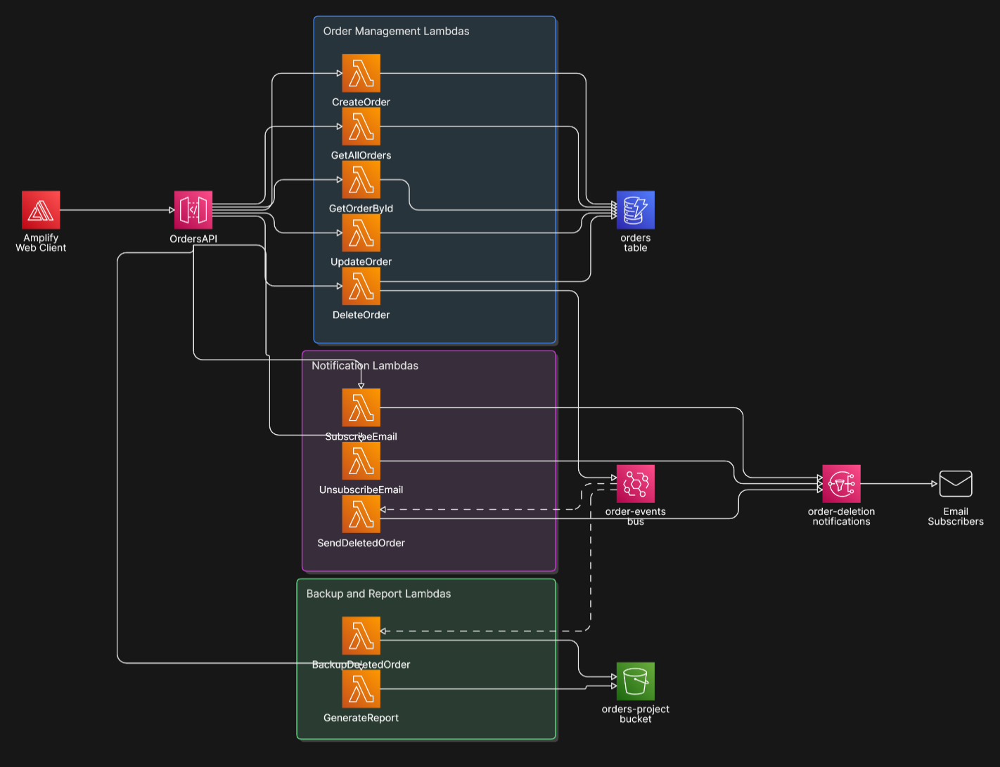

# Event-Driven Serverless Order Management System

## 📌 Overview
This project implements a cloud-based, fully serverless Order Management System. It exposes REST APIs for order management and utilizes an event-driven architecture to react automatically to state changes. 

When an order is deleted, the API responds immediately to the client, while Amazon EventBridge asynchronously fans out the event to background processes that notify subscribed users via email and backup the deleted order to object storage.

**Team Members:** Elias Mouawad, Eran Sadgan, Daniel Gorodnitskiy  
**Date:** May 2026

---

## 🏗️ Architecture & Event Flow

**How the Services Integrate:**
1. A static web client (hosted on **AWS Amplify**) sends HTTPS requests to **API Gateway**.
2. API Gateway invokes the matching **Lambda** function for each route.
3. Create / Get / Update Lambdas interact directly with the **DynamoDB** orders table.
4. The Delete Lambda removes the item from DynamoDB, publishes an `OrderDeleted` event to a custom **EventBridge** bus, and returns a response immediately to the user.
5. EventBridge routes the event in parallel to a notification Lambda (**SNS** email) and a backup Lambda (**S3** TXT file).
6. A separate PDF report Lambda reads all backups from S3, generates a PDF summary, and returns a presigned download URL.

---

## ☁️ AWS Tech Stack

* **AWS Lambda (Python / boto3):** Serverless compute running all API handlers and event-driven functions.
* **Amazon DynamoDB:** Persistent NoSQL store utilizing `orderId` (UUID) as the partition key and `creationDate` as the sort key for efficient range queries.
* **Amazon API Gateway:** Exposes the REST APIs and maps routes using proxy integration.
* **Amazon EventBridge:** Event bus routing `OrderDeleted` events to multiple asynchronous targets.
* **Amazon SNS:** Handles email notifications to subscribed users.
* **Amazon S3:** Object storage for deleted-order TXT backups and generated PDF reports.
* **Amazon SQS (Dead Letter Queue):** Captures failed asynchronous events to ensure data resilience.
* **AWS Amplify:** Hosts the static HTML/CSS/JS frontend web client.

---

## 🛡️ Reliability & Fault Tolerance (SQS DLQ)
This system includes a **Dead Letter Queue (DLQ)** using Amazon SQS as a resilience enhancement. Because the delete flow relies on EventBridge delivering events asynchronously, transient failures could result in lost notifications or backups. To prevent data loss, any failed asynchronous events are automatically routed to the SQS DLQ for inspection and reprocessing.

---

## 🔌 REST API Endpoints

| Method | Endpoint | Description |
| :--- | :--- | :--- |
| **POST** | `/orders` | Creates a new order (generates UUID). |
| **GET** | `/orders` | Retrieves all orders, sorted by creation date. |
| **GET** | `/orders/{orderId}` | Retrieves a specific order by ID. |
| **PUT** | `/orders/{orderId}` | Updates the price or description of an order. |
| **DELETE** | `/orders/{orderId}` | Deletes an order and triggers the asynchronous EventBridge flow. |
| **POST** | `/subscribe` | Registers an email for deletion notifications. |
| **POST** | `/unsubscribe` | Removes an email from the notification list. |
| **GET** | `/deleted-orders/report` | Generates and returns a downloadable URL for a PDF summary of deleted orders. |